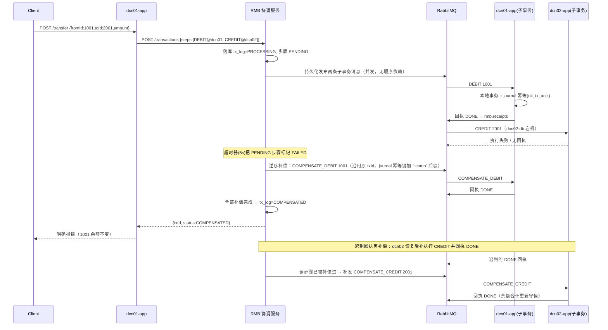
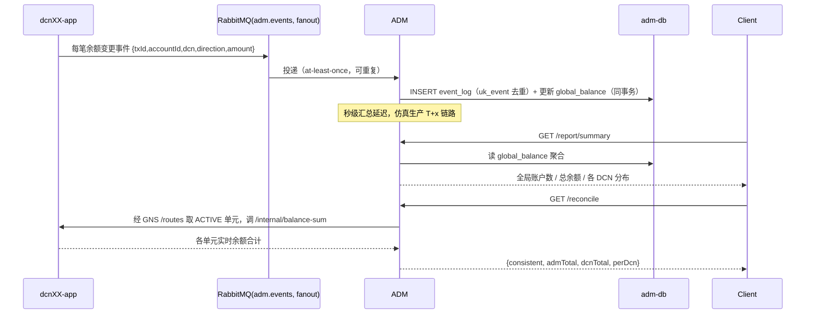
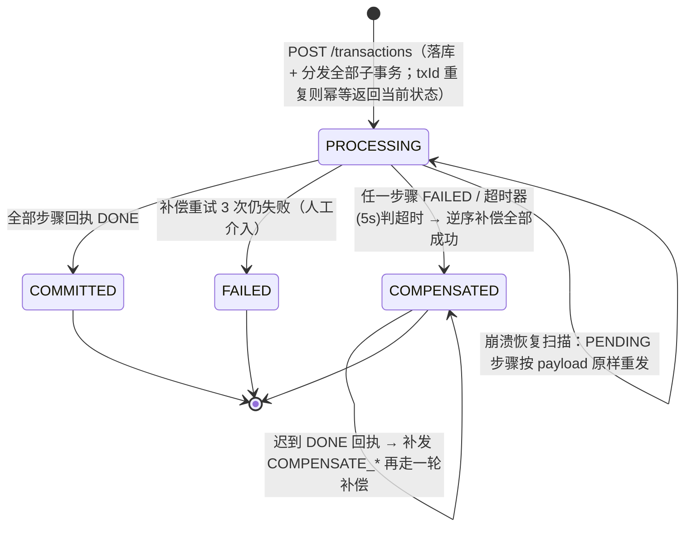

# dcn 模板 · 架构设计文档

本文档是 `dcn` 模板（DCN 单元化架构仿真）的深度设计说明。快速上手见 [README.zh-CN.md](README.zh-CN.md) / [README.md](README.md)。

## 1. 设计动机与单元化收益

集中式核心系统的瓶颈不在单机性能，而在「所有客户共享同一套库与故障域」。DCN 单元化把客户按号段切分，每个单元自带接入、应用与独立数据库，交易尽量在单元内闭环。收益：

- **水平扩展**：容量不足时新增单元 + 注册新号段即可，存量单元与数据无需迁移（本模板 gate 6 演示在线扩容）。
- **爆炸半径收敛**：单单元故障只影响本号段客户（gate 3 停掉 dcn02-db，dcn01 内转账照常，仅跨 dcn02 的交易失败并被补偿）。
- **单实例库即可**：单元内数据量可控，每个单元一套单实例 MySQL 即满足需求，规避分布式库的复杂度。
- **主库交叉部署**：相邻单元主库轮换放在不同 IDC（dcn01→idc1、dcn02→idc2、dcn03→idc1、dcn04→idc2），单 IDC 故障不同时带走所有单元。

## 2. 组件职责与设计规则

四大组件：

| 组件 | 职责 |
|------|------|
| DCN 单元（dcn01/02/03/04） | 号段内账户的全部业务；本地事务单库闭环；作为 RMB 子事务执行方，本地事务 + journal 幂等 |
| GNS | 「账户 → DCN」全局路由（Redis 缓存 + MySQL 回源）；开户分配号段内账号；号段表管理 |
| RMB 协调服务 | 总事务注册、子事务经 RabbitMQ 并发分发、回执归集、超时扫描、逆序补偿、崩溃恢复 |
| ADM | 消费账户变更事件、幂等去重、维护全局余额镜像、汇总报表与核对 |

六条关键设计规则：

1. **交易本地化**：同单元交易在单个本地 DB 事务内完成，不经 RMB。
2. **跨单元必经 RMB**：DCN 应用之间无任何业务直连，跨单元请求一律提交 RMB 总事务。
3. **RMB 协调跨单元事务**：RMB 是跨 DCN 分布式事务的唯一协调者，负责终态收敛（含补偿）。
4. **主库交叉部署**：各单元主库轮换落位两个 IDC（见 §1）。
5. **一主两从（生产）/ 单实例（仿真）**：生产每单元为一主两从分布式库；仿真每单元单实例 MySQL 8。
6. **全局场景归 ADM**：无法按客户拆分的汇总、报表、核对一律下沉 ADM 区，单元不承载全局查询。

## 3. 关键流程时序

### 3.1 DCN 内转账（本地事务）

```mermaid
sequenceDiagram
    participant C as Client
    participant A as dcn01-app
    participant G as GNS
    participant D as dcn01-db
    participant M as RabbitMQ(adm.events)
    C->>A: POST /transfer {fromId:1001,toId:1002,amount}
    A->>G: GET /locate?accountId=1001 / 1002
    G-->>A: 双方均属 dcn01
    A->>D: BEGIN; 条件更新扣款(balance>=amount); 入账; 双方 journal; COMMIT
    D-->>A: OK（任一失败整体回滚）
    A->>M: 发布两条账户变更事件 (at-most-once，commit 后发布)
    A-->>C: 200 成功
```

### 3.2 跨 DCN 转账（含失败补偿与迟到回执再补偿）



### 3.3 ADM 汇总链路（仿真 T+x）



## 4. 事务协调状态机

总事务（tx_log.status）四态迁移：



触发条件明细：

- **回执齐**：回执消费者更新 `tx_step_log`；全部 DONE → `COMMITTED`。
- **步骤失败**：任一步骤回执 FAILED → 对已成功步骤按逆序发反向动作（DEBIT→COMPENSATE_DEBIT，CREDIT→COMPENSATE_CREDIT），补偿消息沿用原 txId（StepMessage 不变），仅 DCN 端 journal 幂等键由 `contracts.StepDirection` 加 `:comp` 后缀区分。
- **超时器**：每 1s 扫描 PROCESSING 且超过 `TX_TIMEOUT_SECONDS`（默认 5s）的事务，把 PENDING 步骤标记 FAILED 后进入补偿；已存在 COMPENSATE_* 步骤的事务跳过。
- **补偿失败 3 次**：补偿步骤失败最多重置重投 3 次，仍失败 → `FAILED`，需人工介入。
- **崩溃恢复**：协调服务启动时扫描 PROCESSING 事务，把 PENDING 步骤按落库的 `payload` 原样重发（DCN 端 journal 幂等保证重发安全）。
- **迟到回执再补偿**：步骤已判 FAILED 且总事务已 COMPENSATED 后又收到 DONE 回执，必须补发一笔 COMPENSATE_* 重新补偿，保证「余额合计不变」最终成立。

所有状态流转打印日志（`tx <txId>: <from> -> <to>`）便于人工观察；verify 只断言 HTTP 状态与余额，不依赖日志。

## 5. 幂等设计清单

RMB 子事务消息全链路 at-least-once，幂等由各端唯一键兜底；ADM 事件为 commit 后发布（at-most-once），极端崩溃下以 reconcile 核对兜底：

- **DCN journal `uk_tx_acct (tx_id, account_id, direction)`**：子事务重复投递时识别已存在，直接回成功回执，余额不重复变动（gate 5 断言）。
- **补偿 `:comp` 后缀**：补偿 StepMessage 沿用原 txId（不变）；仅 DCN 端 journal 幂等键由 `contracts.StepDirection` 给 COMPENSATE_* 动作派生 `:comp` 后缀（`<txId>:comp`），与原始子事务的 journal 键互不冲突。
- **GNS `request_id`**：`account_route.request_id` 唯一键，开户请求重复提交返回首次结果；seed 使用 `seed-<scale>-<seg>-<i>` 作为幂等键，重复灌数不产生重复账户。
- **ADM `uk_event (tx_id, account_id, direction)`**：event_log 唯一键去重，at-least-once 事件重复消费安全。
- **协调服务 txId 幂等注册**：`POST /transactions` 携带已存在的 `txId` → 直接返回当前状态，不重复落库、不重复分发。

## 6. 数据模型（DDL 摘要）

四个库（dcnXX_db 四单元共用同一 schema；建表经 `/docker-entrypoint-initdb.d` 初始化，dcn04 首次启动自动建表）：

| 库 | 表 | 关键字段 / 约束 |
|----|----|----------------|
| gns_db | `route_segment` | `dcn` PK；`seg_start/seg_end`；`endpoint`；`status`(ACTIVE/DRAINING) |
| gns_db | `account_route` | `account_id` PK；`dcn`；`request_id` UNIQUE 可空（开户幂等键） |
| rmb_db | `tx_log` | `tx_id` PK；`type`；`status`(PROCESSING/COMMITTED/COMPENSATED/FAILED) |
| rmb_db | `tx_step_log` | PK `(tx_id, step_no)`；`dcn`；`action`(DEBIT/CREDIT/COMPENSATE_DEBIT/COMPENSATE_CREDIT)；`status`(PENDING/DONE/FAILED/COMPENSATED)；`payload` TEXT（原始子事务 JSON，补偿取参 / 重发 / 崩溃恢复的依据） |
| dcnXX_db | `account` | `account_id` PK；`balance DECIMAL(18,2) CHECK (balance >= 0)`（条件更新防透支） |
| dcnXX_db | `journal` | `tx_id + account_id + direction`；UNIQUE KEY `uk_tx_acct`（幂等兜底） |
| adm_db | `event_log` | 事件审计 + 去重；UNIQUE KEY `uk_event (tx_id, account_id, direction)` |
| adm_db | `global_balance` | `account_id` PK；`dcn`；`balance`（全局镜像汇总） |

完整 DDL 见 `db/init/`（`gns/`、`rmb/`、`dcn/`、`adm/` 各一份 `01_init.sql`）。

## 7. 故障与扩容用例（verify 七关）

`make verify`（`test/verify.sh`）七关，任一失败整体退出 1：

| # | 用例 | 操作 | 预期 |
|---|------|------|------|
| 1 | DCN 内转账 | 1001→1002 转 100 | 成功；双方余额精确变化 |
| 2 | 跨 DCN 转账 | 1001→2001 转 50 | 状态 COMMITTED；两库余额精确变化 |
| 3 | 爆炸半径 | `docker stop dcn02-db` | 1001→1002 成功；1001→2001 明确报错且总事务 COMPENSATED（1001 余额不变，扣款被逆序冲正）；dcn02 恢复后迟到回执触发再补偿，余额合计守恒；3001 余额正常；最后 `docker start dcn02-db` 恢复 |
| 4 | 协调者崩溃恢复 | 转账进行中 `docker restart rmb-coordinator` | 恢复后事务达到终态；两库余额合计与转账前一致 |
| 5 | 幂等 | 用 `docker exec dcn-rabbitmq rabbitmqadmin publish` 向 `rmb.steps.dcn01` 重投一条已完成的 DEBIT 子事务消息 | 余额无重复变动（journal 唯一键兜底） |
| 6 | 在线扩容 | `docker compose --profile expansion up -d --build dcn04-db dcn04-app` → `POST /routes` 注册 dcn04（4000–4999） | 新开户落入 4xxx；4001→1001 跨新旧单元转账 COMMITTED |
| 7 | ADM 汇总 | 等待 3s 汇总延迟 | `/report/summary` 账户数/总余额正确；`/reconcile` 返回 consistent=true |

辅助：`make topology-test`（`test/topology.sh`）用 `docker compose config --format json` + jq 静态断言三网络存在、各 DB 仅接入所属 IDC 网络、DCN 应用双网卡、dcn04 在 expansion profile。
