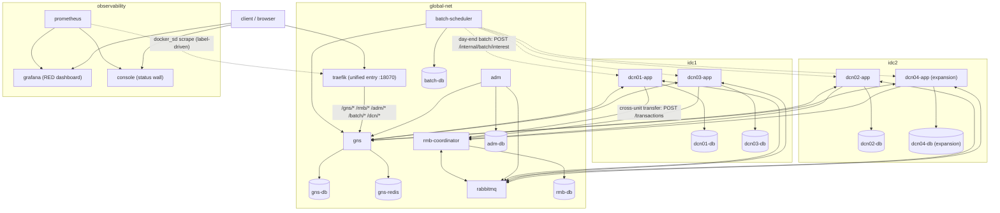

# dcn — jiade template: DCN unitized architecture simulation (GNS / RMB / DCN units / ADM)

[中文文档](README.zh-CN.md)

A simulation of the **DCN (Data Center Node) unitized architecture**: customer account segments are split into self-contained units, GNS provides global routing, RMB is the only legal cross-unit channel and coordinates distributed transactions, and ADM aggregates global reports. Generated by `jiade init --template dcn` and **self-contained**: it runs independently without jiade (only Docker and Go required).

This template is part of the [jiade](../../README.md) project. For deep design details, see [ARCHITECTURE.md](ARCHITECTURE.md) (中文).

## Topology

Three docker networks simulate two IDCs and a global zone. DCN applications are dual-homed (their own IDC network + `global-net`); DCN databases live only in their IDC network. **There is no direct DCN-to-DCN edge** — cross-unit traffic always goes through RMB.



## Components

| Component | Responsibility |
|-----------|---------------|
| **DCN unit** (dcn01/02/03/04, each = app + own MySQL) | Self-contained unit owning one account segment; executes local transactions in a single DB transaction and RMB sub-transactions (DEBIT/CREDIT/COMPENSATE_*) with journal idempotency |
| **GNS** (Global Name Service) | Global "account → DCN" routing: `/locate` (Redis-cached), account opening with segment allocation, segment table management (`/routes`) for online expansion |
| **RMB** (reliable message bus + coordinator) | The only legal cross-DCN channel; registers global transactions, dispatches sub-transactions via RabbitMQ, collects receipts, and drives reverse-order compensation on failure/timeout |
| **ADM** (administration zone) | Consumes account-change events, deduplicates them, maintains a global balance mirror, and exposes `/report/summary` and `/reconcile` |
| **batch-scheduler** | Day-end batch scheduling (currently interest accrual only): reads ACTIVE units from GNS, calls each unit's `/internal/batch/interest` concurrently, aggregates per-unit results, and reruns idempotently by `bizDate` |
| **traefik** | Unified access layer: path-prefix routing (`/gns/*`, `/rmb/*`, `/adm/*`, `/batch/*`, `/dcn/*`) to the backend services; dashboard on port 18071 |
| **console** | Observability wall (topology view + container status + RPS curves) backed by the Prometheus HTTP API and the Docker Engine API (read-only) |

## Segment routing

Account IDs are allocated starting at `segStart + 1` (the first account of segment 1000–1999 is 1001). `make seed` (dev scale) opens 50 accounts per unit via GNS: the first two of each unit (1001/1002, 2001/2002, 3001/3002) start with 1000.00, the rest get deterministic pseudo-random balances between 100.00 and 100000.00. `make seed-full` opens 2000 per unit.

| Segment | DCN | Primary DB IDC |
|---------|-----|----------------|
| 1000–1999 | dcn01 | idc1 |
| 2000–2999 | dcn02 | idc2 |
| 3000–3999 | dcn03 | idc1 |
| 4000–4999 | dcn04 | idc2 (registered by the expansion scenario; does not exist initially) |

## Quickstart

Prerequisites: Docker (Docker Desktop with ≥ 4 GB memory recommended — the full base stack runs 22 containers, 24 after expansion) and Go (for `seed` and the test scripts).

```bash
make up && make seed && make verify
```

`make up` builds and starts the full topology (base three units; dcn04 stays off under the `expansion` profile). `make seed` opens the dev accounts via GNS. `make verify` runs the 8-gate acceptance suite (local transfer, cross-DCN transfer, blast radius, coordinator crash recovery, idempotency, online expansion, ADM aggregation, day-end batch). Other targets: `make down`, `make seed-full`, `make topology-test`, `make smoke`.

Observability entrypoints once the stack is up:

- **http://localhost:18099** — console (topology view, container status wall, per-service RPS)
- **http://localhost:13000** — Grafana RED dashboard (anonymous viewer, no login)
- http://localhost:19090 — Prometheus; http://localhost:18070 — traefik unified entry; http://localhost:18071 — traefik dashboard

As a jiade user, the equivalent flow is:

```bash
jiade init --template dcn --dir ./mydcn && cd ./mydcn && jiade up && jiade seed
```

## Hands-on

```bash
# Locate an account (GNS, Redis-cached)
curl -sf 'localhost:18080/locate?accountId=1001'

# Local transfer within dcn01 (single local DB transaction)
curl -sf -X POST localhost:18081/transfer \
  -H 'Content-Type: application/json' \
  -d '{"fromId":1001,"toId":1002,"amount":"100.00"}'

# Cross-DCN transfer dcn01 → dcn02 (RMB global transaction, synchronous result)
curl -sf -X POST localhost:18081/transfer \
  -H 'Content-Type: application/json' \
  -d '{"fromId":1001,"toId":2001,"amount":"50.00"}'

# Global aggregation report (ADM)
curl -sf localhost:18091/report/summary
curl -sf localhost:18091/reconcile

# Day-end interest accrual batch (via the gateway; idempotent per bizDate)
curl -sf -X POST localhost:18070/batch/jobs/interest \
  -H 'Content-Type: application/json' \
  -d "{\"bizDate\":\"$(date +%F)\"}"
```

Online expansion in four steps (bring the unit up **before** registering its route, so GNS never routes account creation to a unit that is not ready):

```bash
# 1. Start the new unit (expansion profile)
docker compose --profile expansion up -d --build dcn04-db dcn04-app

# 2. Register the new segment in GNS
curl -sf -X POST localhost:18080/routes \
  -H 'Content-Type: application/json' \
  -d '{"dcn":"dcn04","segStart":4000,"segEnd":4999,"endpoint":"http://dcn04-app:8080"}'

# 3. Open an account — it lands in the 4xxx segment
curl -sf -X POST localhost:18080/accounts \
  -H 'Content-Type: application/json' \
  -d '{"name":"alice","initBalance":"500.00","requestId":"demo-1"}'

# 4. Transfer across old and new units
curl -sf -X POST localhost:18084/transfer \
  -H 'Content-Type: application/json' \
  -d '{"fromId":4001,"toId":1001,"amount":"10.00"}'
```

## Ports

| Port | Service | Port | Service |
|------|---------|------|---------|
| 18070 | traefik unified entry | 13306 | dcn01-db |
| 18071 | traefik dashboard | 13307 | dcn02-db |
| 18080 | gns | 13308 | dcn03-db |
| 18081 | dcn01-app | 13309 | gns-db |
| 18082 | dcn02-app | 13310 | rmb-db |
| 18083 | dcn03-app | 13311 | adm-db |
| 18084 | dcn04-app (expansion) | 13312 | dcn04-db (expansion) |
| 18090 | rmb-coordinator | 13313 | batch-db |
| 18091 | adm | 16379 | gns-redis |
| 18092 | batch-scheduler | 15672 | rabbitmq management console |
| 18099 | console (observability wall) | 19090 | prometheus |
| 13000 | grafana (RED dashboard) | | |

## Differences from a production DCN architecture

1. **Data scale and database engine.** In production each DCN serves millions of customers on a distributed database with a one-primary-two-replica topology; this simulation uses a single-instance MySQL 8 per unit and thousand-account segments.
2. **RMB capability.** In production RMB is a self-developed message bus with flow control, circuit breaking, and permission management; this simulation uses RabbitMQ plus a hand-written coordinator service and implements only the core transaction semantics.
3. **Multi-IDC deployment.** Production runs multiple replicas within a city plus remote disaster recovery; this simulation only models cross-IDC placement of primary databases with docker networks, without replicas. Multiple DCNs in the same IDC share one docker network, so network-layer isolation is not simulated — the "no direct cross-unit connection" rule is enforced by application code and convention, not by the network.
4. **Global-scenario storage.** Production uses a native distributed database for global scenarios (evidence storage, batch processing); this simulation substitutes MySQL in the ADM zone.
5. **Security and compliance.** This simulation includes no security or compliance capabilities (encryption, auditing, authorization); it is for architecture learning and demonstration only.
6. **Batch scheduling.** Production day-end batch platforms offer dependency orchestration, checkpoints, and resume-from-failure across many job types; this simulation has a single job type (interest accrual) with per-unit concurrent execution and `bizDate`-level idempotent rerun — no dependency DAG.
7. **Observability.** Production observability stacks include alerting, log aggregation, and distributed tracing; this simulation ships metrics only (RED instrumentation + Prometheus + Grafana dashboard + console wall), without alerting, logs, or tracing.

## Known simplifications

- **ADM aggregation lag is seconds-level.** The event-driven global mirror intentionally simulates the production T+x aggregation pipeline, so `/report/summary` trails real balances briefly.
- **ADM events are published after commit (at-most-once).** A crash between commit and publish loses the event, so the global mirror may briefly diverge from DCN balances; `/reconcile` is the safety net.
- **Compensation retry is bounded.** A sub-transaction compensation is retried at most 3 times; after that the transaction is marked `FAILED` and requires manual intervention.
- **`seed --reset` covers only the base three-unit topology.** It wipes the dcn01/02/03, GNS, RMB, and ADM tables plus the GNS Redis cache; if you have expanded dcn04, tear it down yourself (`docker compose --profile expansion down`) before resetting.
