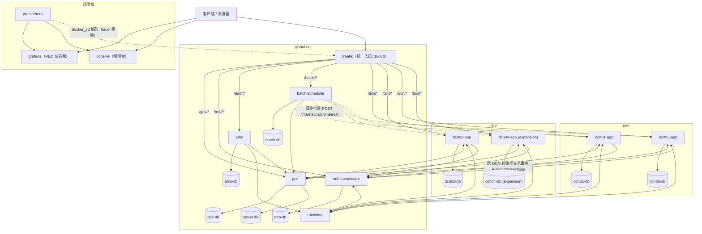

# dcn — jiade 模板：DCN 单元化架构仿真（GNS / RMB / DCN 单元 / ADM）

[English](README.md)

这是 **DCN（Data Center Node）单元化架构**的仿真版：按客户号段把系统切成若干自包含单元，GNS 负责全局路由定位，RMB 是跨单元唯一合法通信通道并兼任分布式事务协调者，ADM 承接全局汇总报表。由 `jiade init --template dcn` 生成，**自包含**：脱离 jiade 也能独立运行（仅需 Docker 与 Go）。

本模板属于 [jiade](../../README.zh-CN.md) 项目。深度设计细节见 [ARCHITECTURE.md](ARCHITECTURE.md)。

## 拓扑

三个 docker network 仿真两个 IDC 与一个全局区。DCN 应用为双网卡（本 IDC 网络 + `global-net`），DCN 数据库只接入所属 IDC 网络。**DCN 之间没有直连边**——跨单元流量一律经过 RMB。



## 组件

| 组件 | 职责 |
|------|------|
| **DCN 单元**（dcn01/02/03/04，每个 = 应用 + 独立 MySQL） | 拥有一个账户号段的自包含单元；本地事务在单库事务内完成，RMB 子事务（DEBIT/CREDIT/COMPENSATE_*）以 journal 幂等执行 |
| **GNS**（全局路由定位服务） | 「账户 → DCN」全局路由：`/locate`（Redis 缓存）、开户与号段内账号分配、号段表管理（`/routes`），支撑在线扩容 |
| **RMB**（可靠消息总线 + 协调服务） | 跨 DCN 唯一合法通道；注册总事务、经 RabbitMQ 分发子事务、收集回执，失败或超时驱动逆序补偿 |
| **ADM**（全局管理区） | 消费账户变更事件并去重，维护全局余额镜像，提供 `/report/summary` 与 `/reconcile` 核对 |
| **batch-scheduler**（批量调度服务） | 日终批量调度（本期仅结息）：从 GNS 读取 ACTIVE 单元，并发调用各单元 `/internal/batch/interest`，归集分单元结果，按 `bizDate` 幂等重跑 |
| **traefik**（统一接入层） | 按路径前缀路由（`/gns/*`、`/rmb/*`、`/adm/*`、`/batch/*`、`/dcn/*`）到后端服务；dashboard 见 18071 端口 |
| **console**（观测台） | 单页观测台（拓扑视图 + 容器状态墙 + RPS 曲线），数据源为 Prometheus HTTP API 与 Docker Engine API（只读） |

## 号段路由

账号从 `segStart + 1` 开始分配（号段 1000–1999 的第一个账户是 1001）。`make seed`（dev 档）经 GNS 每单元开户 50 户：每单元前 2 户（1001/1002、2001/2002、3001/3002）初始余额固定 1000.00，其余为确定性伪随机余额（100.00 ~ 100000.00）。`make seed-full` 每单元开户 2000 户。

| 号段 | DCN | 主库 IDC |
|------|-----|----------|
| 1000–1999 | dcn01 | idc1 |
| 2000–2999 | dcn02 | idc2 |
| 3000–3999 | dcn03 | idc1 |
| 4000–4999 | dcn04 | idc2（扩容用例注册，初始不存在） |

## 快速开始

前置要求：Docker（Docker Desktop 建议分配 ≥ 4GB 内存——基础拓扑共 22 个容器，扩容后 24 个）与 Go（seed 与测试脚本需要）。

```bash
make up && make seed && make verify
```

`make up` 构建并启动完整拓扑（基础三单元；dcn04 位于 `expansion` profile，默认不启动）。`make seed` 经 GNS 开出 dev 档账户。`make verify` 运行八关验收（本地转账、跨 DCN 转账、爆炸半径、协调者崩溃恢复、幂等、在线扩容、ADM 汇总、日终批量）。其余目标：`make down`、`make seed-full`、`make topology-test`、`make smoke`、`make integration-test`。

`make integration-test` 对运行中的栈发起外部集成测试（`test/integration/`，Go，build tag `integration`）——按服务的外部行为契约测试，全部走 HTTP。栈不可达时用例自动 Skip；端点可用 `DCN_IT_*` 环境变量覆盖。

栈启动后的观测入口：

- **http://localhost:18099** —— console 观测台（拓扑视图、容器状态墙、各服务 RPS）
- **http://localhost:13000** —— Grafana RED 仪表盘（匿名 Viewer，免登录）
- http://localhost:19090 —— Prometheus；http://localhost:18070 —— traefik 统一入口；http://localhost:18071 —— traefik dashboard

jiade 用户的等价流程：

```bash
jiade init --template dcn --dir ./mydcn && cd ./mydcn && jiade up && jiade seed
```

## 手动体验

```bash
# 定位账户（GNS，Redis 缓存）
curl -sf 'localhost:18080/locate?accountId=1001'

# dcn01 内本地转账（单库本地事务）
curl -sf -X POST localhost:18081/transfer \
  -H 'Content-Type: application/json' \
  -d '{"fromId":1001,"toId":1002,"amount":"100.00"}'

# 跨 DCN 转账 dcn01 → dcn02（RMB 总事务，同步返回结果）
curl -sf -X POST localhost:18081/transfer \
  -H 'Content-Type: application/json' \
  -d '{"fromId":1001,"toId":2001,"amount":"50.00"}'

# 全局汇总报表（ADM）
curl -sf localhost:18091/report/summary
curl -sf localhost:18091/reconcile

# 日终结息批量（经网关触发；同一 bizDate 幂等）
curl -sf -X POST localhost:18070/batch/jobs/interest \
  -H 'Content-Type: application/json' \
  -d "{\"bizDate\":\"$(date +%F)\"}"
```

在线扩容四步（**先起单元再注册路由**，避免 GNS 把开户路由到未就绪单元）：

```bash
# 1. 启动新单元（expansion profile）
docker compose --profile expansion up -d --build dcn04-db dcn04-app

# 2. 在 GNS 注册新号段
curl -sf -X POST localhost:18080/routes \
  -H 'Content-Type: application/json' \
  -d '{"dcn":"dcn04","segStart":4000,"segEnd":4999,"endpoint":"http://dcn04-app:8080"}'

# 3. 开户——新账户落入 4xxx 号段
curl -sf -X POST localhost:18080/accounts \
  -H 'Content-Type: application/json' \
  -d '{"name":"alice","initBalance":"500.00","requestId":"demo-1"}'

# 4. 新旧单元之间转账
curl -sf -X POST localhost:18084/transfer \
  -H 'Content-Type: application/json' \
  -d '{"fromId":4001,"toId":1001,"amount":"10.00"}'
```

## 端口速查

| 端口 | 服务 | 端口 | 服务 |
|------|------|------|------|
| 18070 | traefik 统一入口 | 13306 | dcn01-db |
| 18071 | traefik dashboard | 13307 | dcn02-db |
| 18080 | gns | 13308 | dcn03-db |
| 18081 | dcn01-app | 13309 | gns-db |
| 18082 | dcn02-app | 13310 | rmb-db |
| 18083 | dcn03-app | 13311 | adm-db |
| 18084 | dcn04-app（expansion） | 13312 | dcn04-db（expansion） |
| 18090 | rmb-coordinator | 13313 | batch-db |
| 18091 | adm | 16379 | gns-redis |
| 18092 | batch-scheduler | 15672 | rabbitmq 管理台 |
| 18099 | console 观测台 | 19090 | prometheus |
| 13000 | grafana（RED 仪表盘） | | |

## 与生产架构的差异

1. **数据规模与数据库形态。** 生产每 DCN 客户数百万级、库为一主两从的分布式数据库；仿真为单实例 MySQL 8、每 DCN 千级号段。
2. **RMB 能力。** 生产 RMB 为自研总线，具备流控/熔断/权限管控；仿真用 RabbitMQ + 自写协调服务，仅实现核心事务语义。
3. **多 IDC 部署。** 生产多 IDC 同城多副本 + 异地灾备；仿真以 docker network 模拟 2 个 IDC 的主库交叉部署，不实现副本；同 IDC 内多 DCN 共享一个 network，网络层隔离不仿真——「跨单元不直连」靠应用代码与约定保证，而非网络强制。
4. **全局场景存储。** 生产全局场景（存证、批量）使用原生分布式数据库；仿真以 MySQL 代替（ADM 区）。
5. **安全合规。** 仿真不含安全合规能力（加密、审计、权限），仅供架构学习演示。
6. **批量调度。** 生产日终批量平台具备多任务类型的依赖编排、断点续跑；仿真仅单任务类型（结息），按单元并发执行、按 `bizDate` 幂等重跑，无依赖 DAG。
7. **观测体系。** 生产观测含告警、日志聚合与链路追踪；仿真仅指标（RED 埋点 + Prometheus + Grafana 仪表盘 + console 观测台），无告警、日志与链路。

## 已知简化

- **ADM 汇总为秒级延迟。** 事件驱动的全局镜像刻意仿真生产的 T+x 汇总链路，`/report/summary` 会短暂落后于实时余额。
- **ADM 事件为 commit 后发布（at-most-once）。** 极端崩溃下（commit 与发布之间宕机）汇总可能与 DCN 短暂不一致，以 `/reconcile` 核对兜底。
- **补偿重试有界。** 子事务补偿最多重试 3 次，之后总事务标记 `FAILED`，需人工介入。
- **`seed --reset` 仅覆盖基础三单元拓扑。** 它清空 dcn01/02/03、GNS、RMB、ADM 各表及 GNS Redis 缓存；若已扩容 dcn04，重置前请自行拆除（`docker compose --profile expansion down`）。
